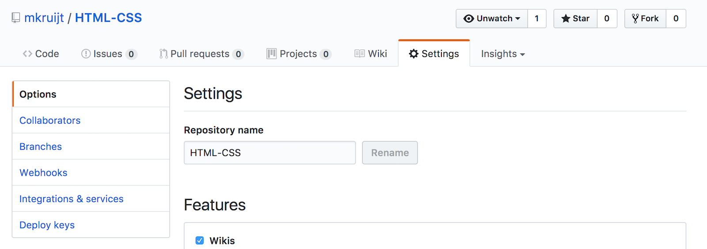
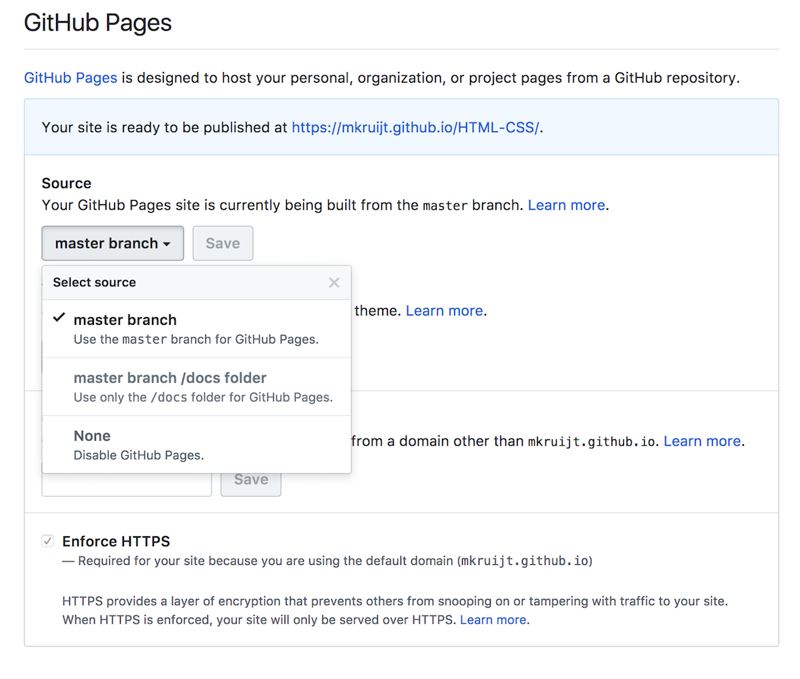

## Homework Week 1

>[Here](https://github.com/HackYourFuture/HTML-CSS/blob/master/Week1/README.md) you find the readings you have to complete before the second lecture.

### Learning goals for this week:
```
 • The division of labor between HTML and CSS
 • Introduction to HTML:
    • Parents, children, attributes
    • Indentation
    • Semantic elements
    • Paragraphs, links, images, lists
 • Introduction to CSS:
    • Where can we write it and what difference does that make?
    • Selectors (id, class, element type), properties
    • How to structure a CSS file
    • Naming things
 • External files: relative and absolute paths
 • Getting to know your text editor
```

## Step 1: Read and watch
#### Good learning practices
Before you start check out this [video](http://www.learningscientists.org/videos/) and/or this [article](https://www.cultofpedagogy.com/learning-strategies/) about good learning practices.

#### HTML5
Read about [HTML5](https://developer.mozilla.org/en-US/docs/Web/Guide/HTML/HTML5) 

#### CSS:
- [CSS reference](http://cssreference.io/) 
- [MDN - Introduction to CSS layout](https://developer.mozilla.org/en-US/docs/Learn/CSS/CSS_layout/Introduction)
- [CSS-tricks - CSS Properties](https://css-tricks.com/almanac/properties/)
- [MDN - CSS box model](https://developer.mozilla.org/en-US/docs/Web/CSS/CSS_Box_Model/Introduction_to_the_CSS_box_model)

## Step 2: Give feedback
- In Trello, you are assigned to one of the cards of your fellow students (in the Class11 Week0 HTML/CSS list). Give feedback on the application assignment of your fellow student. Please be critical but most of all give constructive feedback. If there are resources that you used and might be useful, share them.
- revisit you own application assignment and improve it with the feedback and suggestions given by one of your classmates.  

> Don't forget, you can always revisit Khan Academy: [Into to HTML/CSS: Making web pages](https://nl.khanacademy.org/computing/computer-programming/html-css) if you are stuck and need a reminder

## Step 3: Assignment
 - Make your own web resume:
    - One page 
    - Two files: HTML and CSS
    - Include the following:
        - Your personal info (name, place of birth, etc.)
        - A picture
        - A few lines about who you are
        - Education
        - Work experience
    - Include the following:
        - Different types of headings (`<h1>`, `<h2>`)
        - A list (`<ul>`). In this list include the _learning strategies_ you used making your resume. Also include some of the resources/references, this can be documentation/video etc, that where helpful.
        - Another list (`<ul>`). In this list you include the most important platforms/resources where you can find all hyf related information.
        - ``
        - `<p>`
        - Some CSS properties: `margin`, `padding` 
        - Make sure that you page looks nice, and that your text is readable
    - BEFORE you hand it in, read the [Style guide](http://www.w3schools.com/html/html5_syntax.asp) and check your files (you can also use the [HTML validator](https://validator.w3.org)).

### How to hand in Homework:
_Steps_:
1. In your newly created Github account search for the invitation from the HackYourFuture organization to you join your classes team.
2. Create a new repository (name it something like hyf-html-css) make sure you select the option: initialize with README.
3. Inside your new repository create a folder called "week1". If you have trouble finding out how to create a folder in Github check this [Stack Overflow question](https://stackoverflow.com/questions/18773598/creating-folders-inside-github-com-repo-without-using-git)
4. Upload the files you created on your computer (step 3 of the homework) inside this folder, write a description for this “commit” (for example: "homework week1").
5. Your hyf-html-css/week1 should now contain an index.html and a main.css file (and maybe a folder containing your images)
6. Open the files in your folder to check if all of this worked.
7. Now go to the settings of your repository:
8. And go to _Github Pages_ select "master" instead of "none"
9. Now you can view your homework online at: https://_hereyouplaceyourgithubusername_/hyf-html-css/week1 
10. Please upload a link to your homework in Trello.

### Here is an example of how your homework repository should look:
- https://github.com/mkruijt/HTML-CSS
- In the README file there are links to the homework hosted by Github!

### Fun to check out:
[Shapes of CSS](https://css-tricks.com/examples/ShapesOfCSS/)

#### Last but not least, when you are done with the homework check the learning goals at the top of this document. Go through each of them and check if you understand what is written there. Try formulating them into questions and answer your own questions (for example: Wat does it mean when you say that there is a division of labor between HTML and CSS? Why is there a division of labor between HTML and CSS?). If you need help with this, first ask Google, than ask in Slack.
